# Adding MCP Servers

> Hack Day reference. Condensed from the [DuploCloud docs](https://docs.duplocloud.com/docs).
> Prerequisite: read [Adding Providers.md](<Adding Providers.md>) first — an MCP server reaches the agent
> only through a Provider's Scope.

**MCP (Model Context Protocol) servers extend the agent with external tool capabilities.** Register one,
bind it to a Scope, and any ticket using that Scope can call its tools.

Configured under **AI Admin → MCP Servers**. Two config types:

| Type | When to use |
| --- | --- |
| **HTTP/SSE** | A standard remote MCP endpoint with a URL. Simplest — start here. |
| **Raw** | A JSON config blob. Needed for `command`-based servers (`uvx`, `npx`) and when you want `${credential.*}` placeholders resolved at runtime. |

> **This is the fast path for sponsor tools.** If a sponsor ships an MCP server, this page is how you
> wire it in.

**The shape of it, either way:** register the server → create a Provider → add a Credential → create a
Scope that links credential + MCP server → file a ticket with that Scope.

---

## Method 1 — HTTP/SSE

### Step 1. Add the MCP server

**AI Admin → MCP Servers → + Add Server**:

- **Name** — display name (e.g. `Linear`)
- **Description** — optional
- **Provider Type** — optional; groups it by category
- **Config Type** — `HTTP/SSE`
- **API Endpoint** — the endpoint URL (e.g. `https://mcp.linear.app/mcp`)
- **Transport** — `http`, or `sse` for Server-Sent Events

Click **Create**.

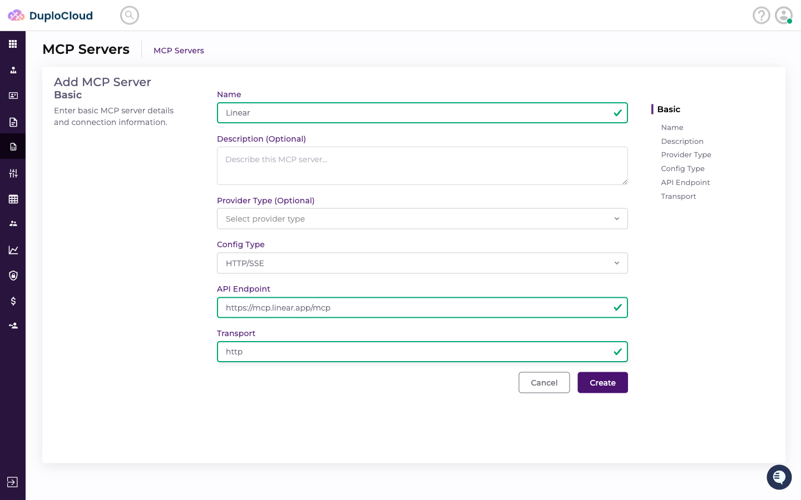

### Step 2. Confirm it saved

The MCP Servers page shows the new server as a card with its endpoint. It can now be linked to any Scope
in any workspace.

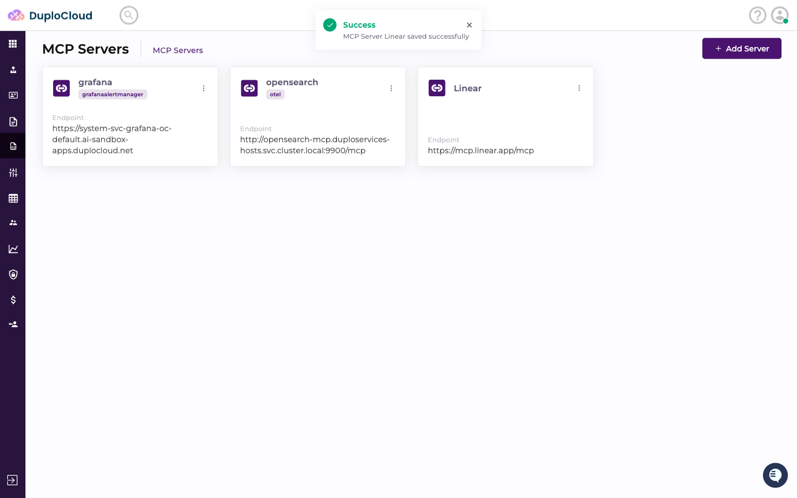

### Step 3. Go to Providers

The server needs a Provider and a Scope to reach an agent. Go to **AI Admin → Providers** and pick the
category tab — **Other** works for most tools.

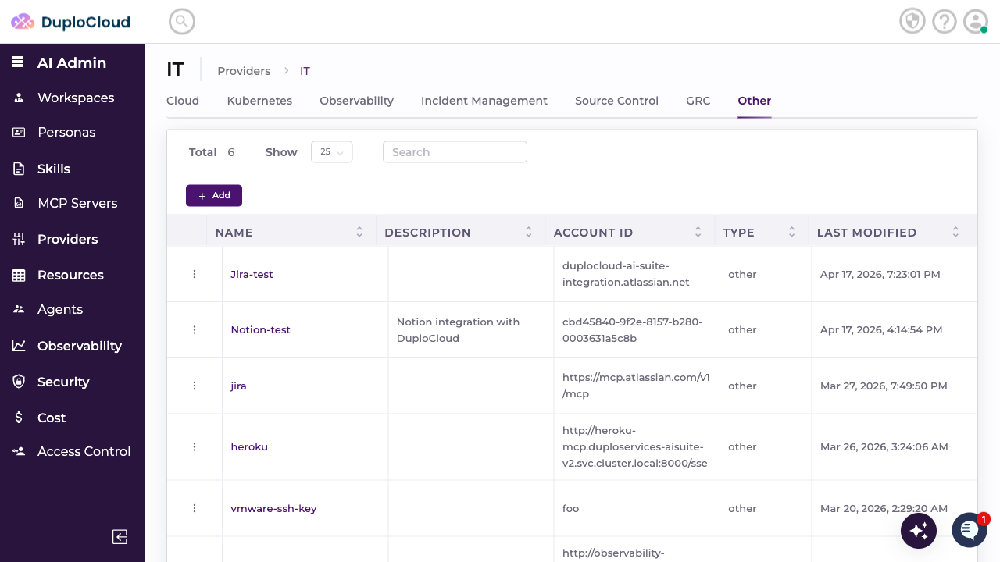

### Step 4. Create the Provider

**+ Add**:

- **Name** (e.g. `Linear`)
- **Type** — the category (e.g. `Other`)
- **Account ID** — any identifier string if routing doesn't need a real one

Click **Create Provider**.

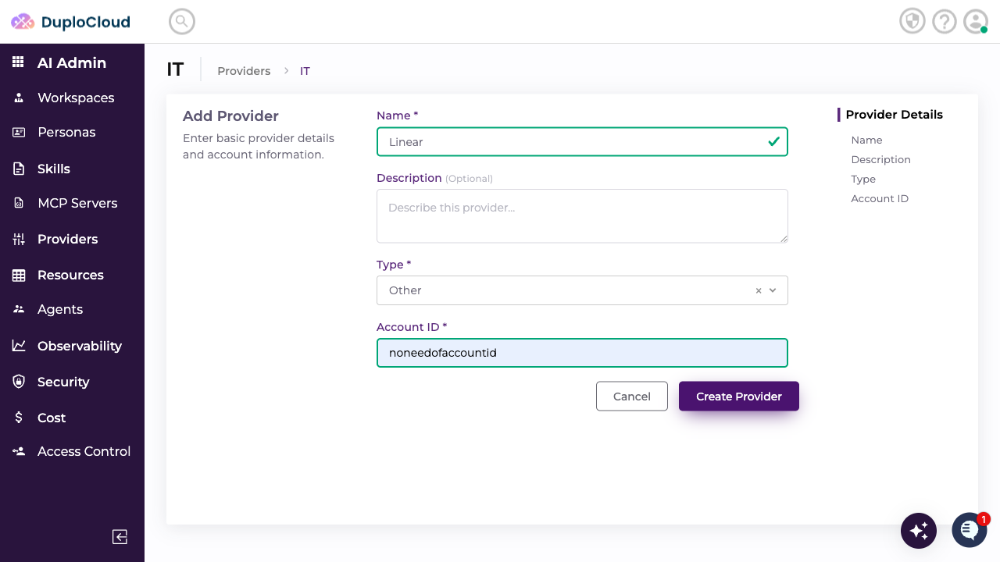

The detail page opens with empty **Credentials** and **Scope** tabs.

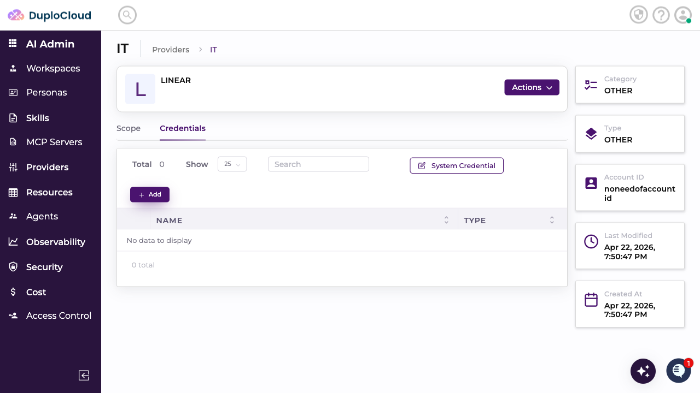

### Step 5. Add the credential

**+ Add** on the Credentials tab:

- **Name** (e.g. `Linear-credentials`)
- **Credential Fields** — key/value pairs for the secrets this provider needs:
  - **Key** — e.g. `LINEAR_API_KEY`
  - **Value** — the secret
  - **Type** — `String` for most
  - **Sensitive** — toggle on to encrypt and mask it

Click **Create**.

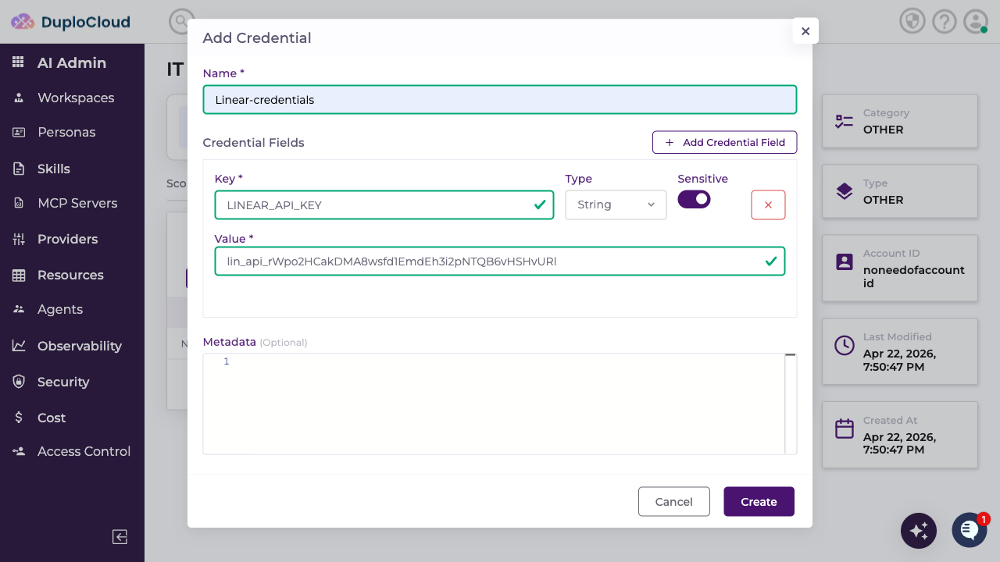

### Step 6. Create the Scope

**+ Add** on the **Scope** tab:

- **Name** — what you'll pick when creating a ticket (e.g. `Linear-Test-MCP`)
- **Credential** — the set from step 5
- **MCP Server** — the server from step 1
- **Resource Map** — optional

Click **Create**.

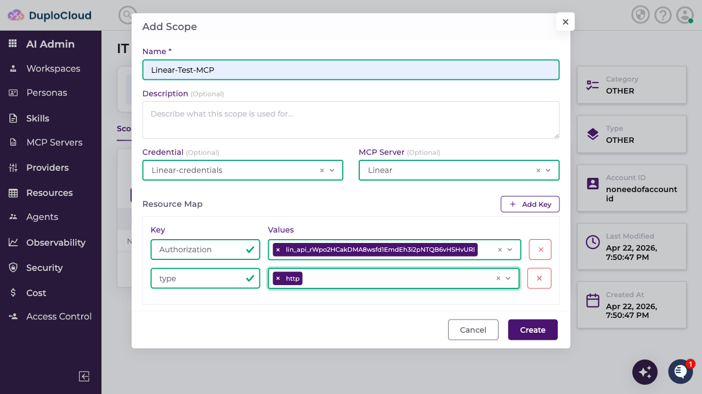

### Step 7. Use it

Create a ticket and select that Scope. The agent now has the MCP tools and calls them with the
credentials bound to the Scope — here `mcp__Linear__list_issues`.

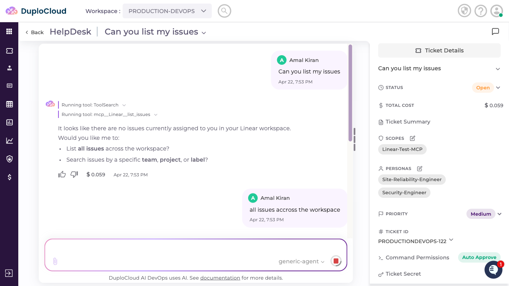

It returns structured data from the tool.

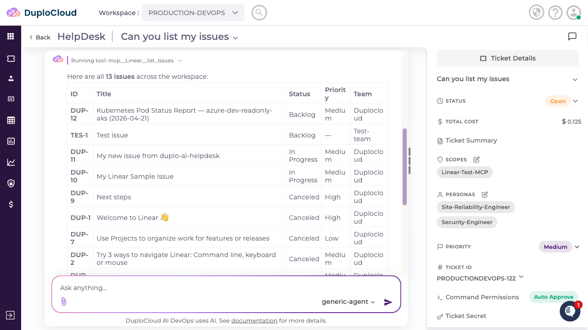

---

## Method 2 — Raw JSON

Use Raw for full control, and whenever the server runs as a local command rather than a remote URL. Raw
supports **credential placeholders**, so secrets resolve at runtime instead of sitting inline in config.

### Step 1. Add the server with a Raw config

**AI Admin → MCP Servers → + Add Server**:

- **Name** (e.g. `Grafana`)
- **Provider Type** — optional (e.g. `OpenTelemetry`)
- **Config Type** — `Raw`
- **Raw Config** — the MCP JSON, with `${credential.<key>}` wherever a value should come from the Scope's
  credentials

```json
{
  "mcpServers": {
    "grafana": {
      "command": "uvx",
      "args": ["mcp-grafana"],
      "env": {
        "GRAFANA_URL": "${credential.url}",
        "GRAFANA_SERVICE_ACCOUNT_TOKEN": "${credential.token}"
      }
    }
  }
}
```

Click **Create**.

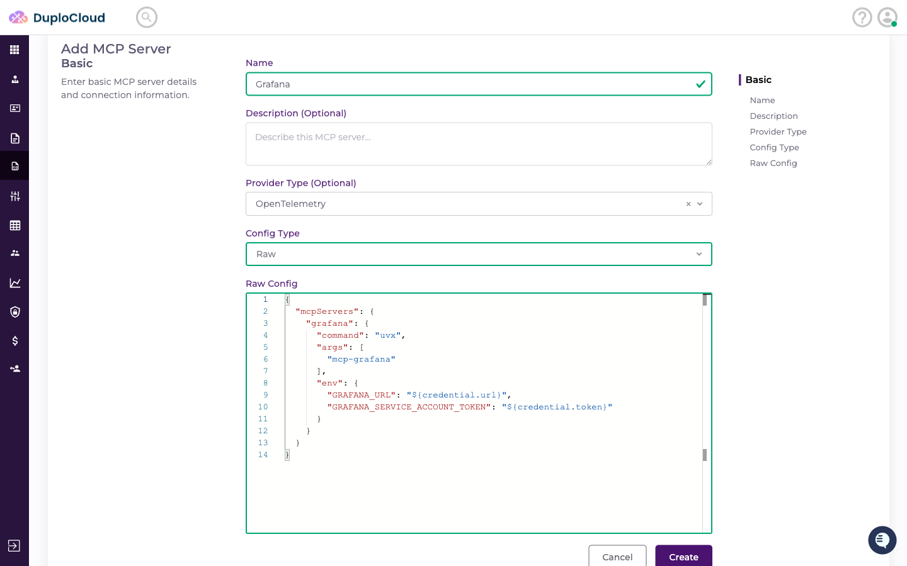

### Step 2. Go to Providers

Pick the category matching your provider type — **Observability** for Grafana.

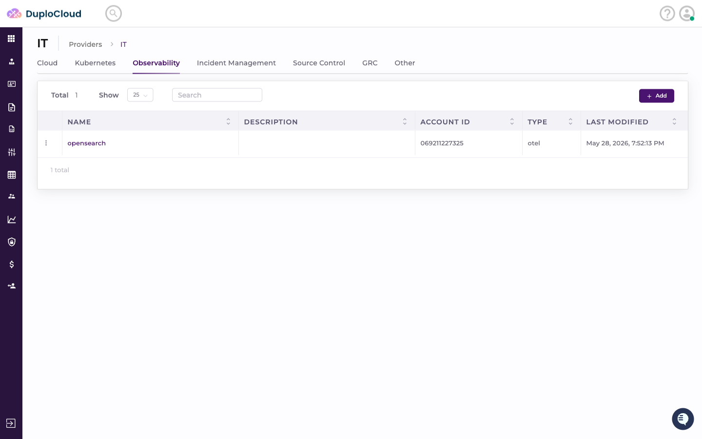

### Step 3. Create the Provider

**+ Add**: **Name** (e.g. `Grafana`), **Type** (e.g. `OpenTelemetry`), **Account ID** (e.g.
`grafana.com`). Click **Next** to go straight to Credentials, or **Create** to save and come back.

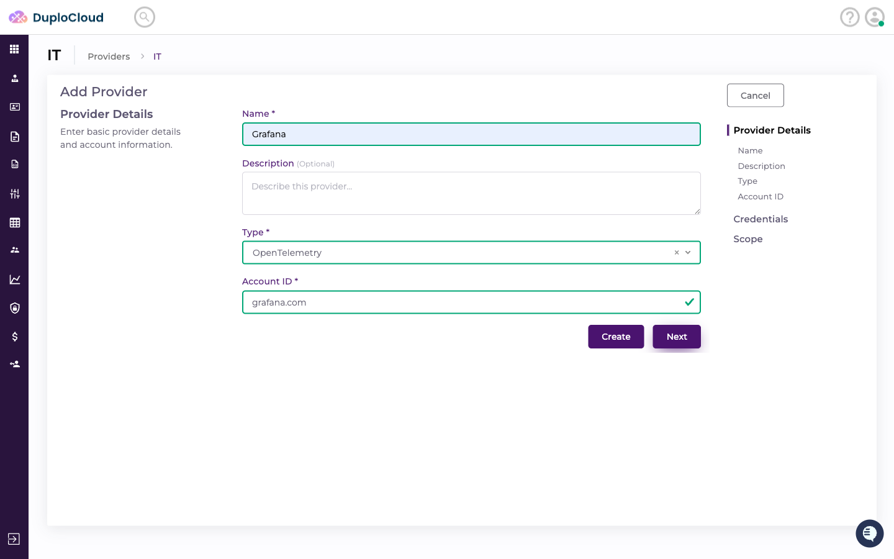

### Step 4. Add credentials that match your placeholders

One field per placeholder key in the Raw Config. **The names must match exactly — they're
case-sensitive:**

| Credential field | Resolves |
| --- | --- |
| `token` | `${credential.token}` |
| `url` | `${credential.url}` |

Mark tokens and passwords **Sensitive**. Click **Create**, then **Next**.

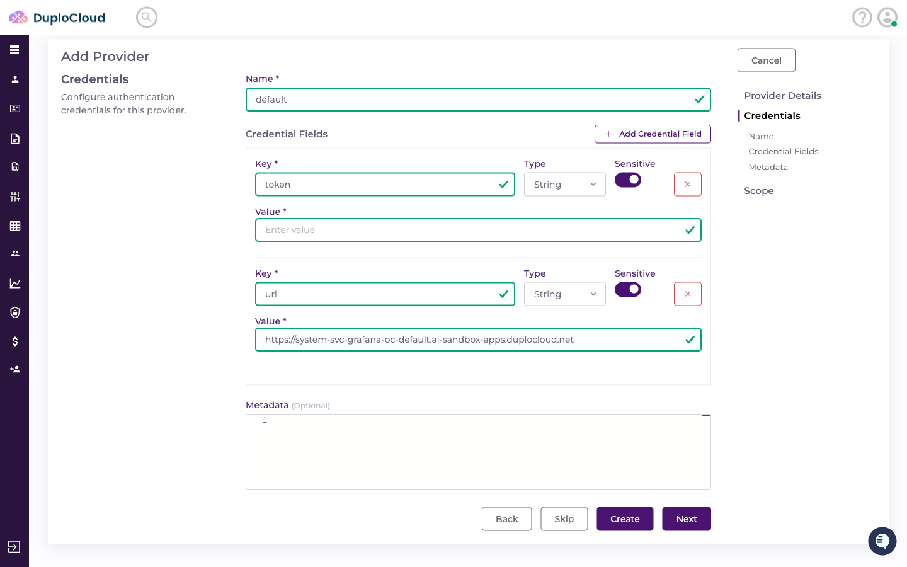

> **This is the #1 thing that breaks Raw configs.** A mismatched or mis-cased field name means the
> placeholder resolves empty and the server starts without its credentials.

### Step 5. Create the Scope

- **Name** (e.g. `Grafana-MCP`)
- **Credential** — pre-filled from step 4
- **MCP Server** — the Raw server from step 1
- **Resource Map** — optional

Click **Create**.

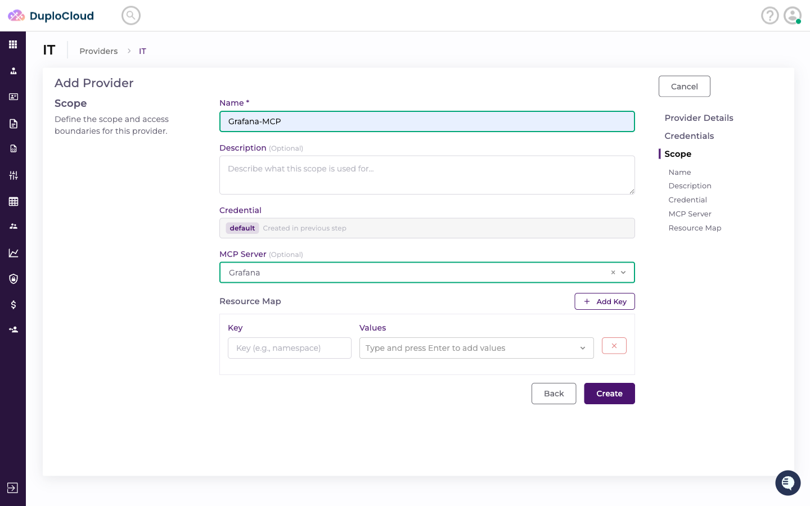

The Providers list now shows it alongside your other providers.

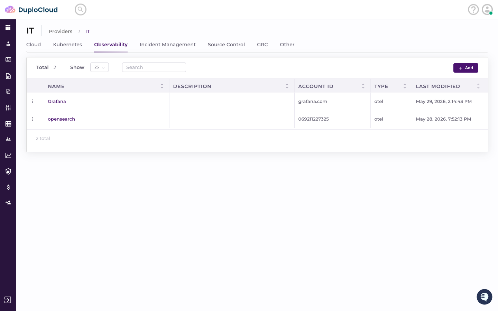

### Step 6. Use it

Create a ticket with that Scope. Before the session starts, the platform resolves every
`${credential.*}` placeholder and writes the finished `.mcp.json` for the agent — which then calls the
tools transparently.

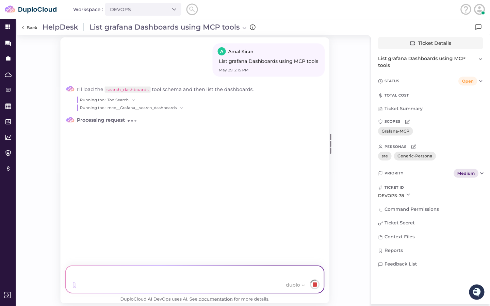

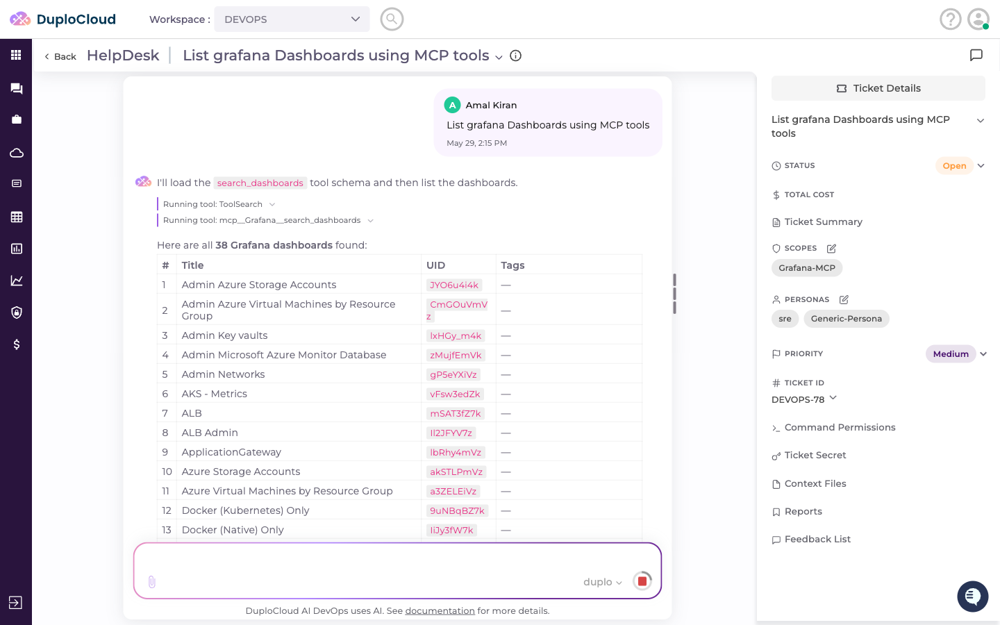

---

## You're done when

- [ ] The server appears as a card on the MCP Servers page
- [ ] A Scope exists that names both a credential **and** that MCP server
- [ ] A ticket on that Scope shows the agent calling an `mcp__<Server>__<tool>` function

---

## Next

- [Adding Skills.md](<Adding Skills.md>) — teach the agent *when* to reach for those tools
- [Adding Workspaces.md](<Adding Workspaces.md>) — attach the Scope to a Workspace so a team can use it

**Stuck?** See [Getting Support.md](<Getting Support.md>) — Slack, email, and the sponsor desk.
