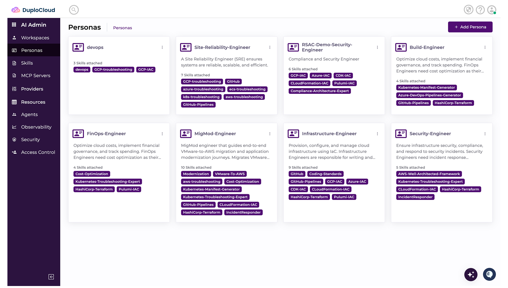
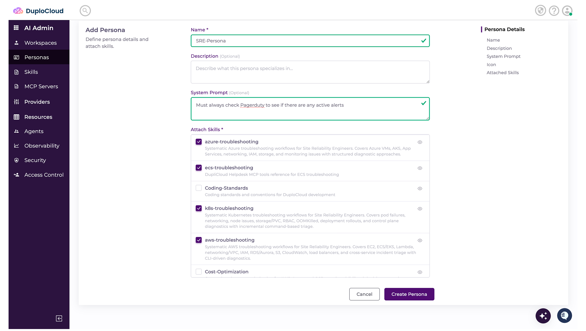

# Adding Personas

> Hack Day reference. Condensed from the [DuploCloud docs](https://docs.duplocloud.com/docs).
> Prerequisite: you need Skills first — see [Adding Skills.md](<Adding Skills.md>).

**A Persona is a logical container that groups related Skills by role or function.** It's the layer
between individual skills and a Workspace.

Examples:

| Persona | Bundles |
| --- | --- |
| **SRE** | Troubleshooting, monitoring, incident response |
| **Provisioning** | Terraform and Kubernetes deployment |
| **Security** | Compliance and security scanning |

A Persona can also carry **System Prompts** that every skill inside it inherits — the place to put
standing instructions that apply across the whole role.

---

## Creating a Persona

### 1. Start

Select **Personas** and click **Add Persona**.

### 2. Fill it in

- **Name** — the role or function
- **Description** *(optional)*
- **System Prompts** *(optional)* — instructions applying to every Skill in this Persona; they're
  inherited automatically
- **Skills** — select the ones to include

### 3. Click **Create Persona**

---

## You're done when

- [ ] The Persona appears in the Personas list
- [ ] It lists the Skills you attached
- [ ] It's selectable when you create a Workspace

---

## Worth knowing

**Persona instructions win.** If a Persona's instructions conflict with a Workspace's System Prompt, the
Persona takes precedence. Keep the Persona for how the role behaves, and the Workspace System Prompt for
context specific to that workspace.

---

## Next

- [Adding Workspaces.md](<Adding Workspaces.md>) — attach Personas and Scopes to a Workspace, and you
  have a working agent

**Stuck?** See [Getting Support.md](<Getting Support.md>) — Slack, email, and the sponsor desk.
