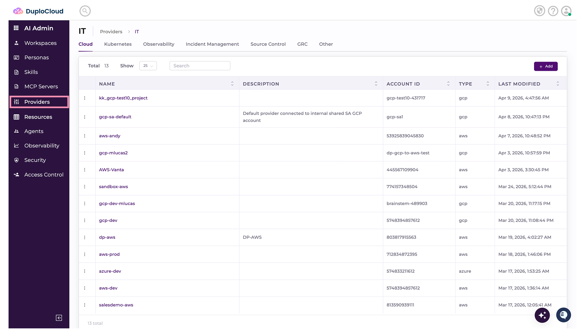
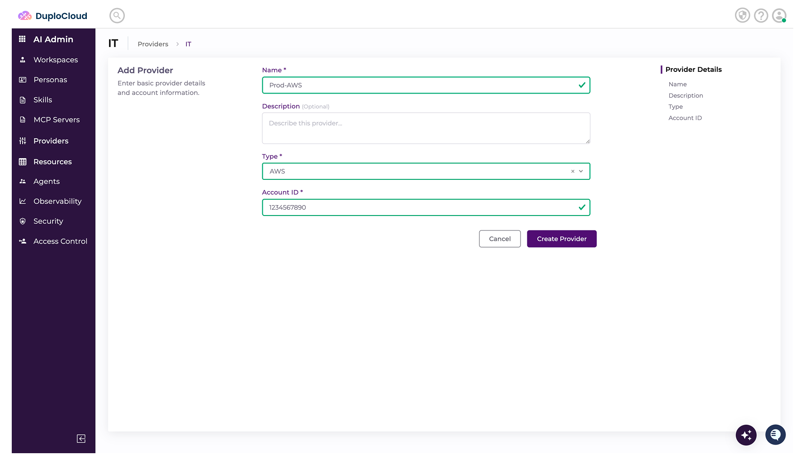
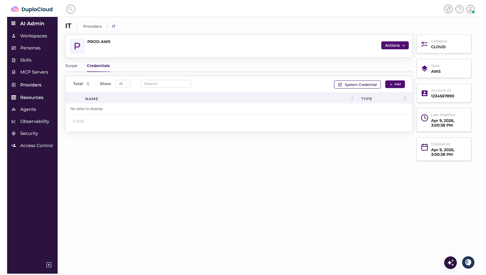
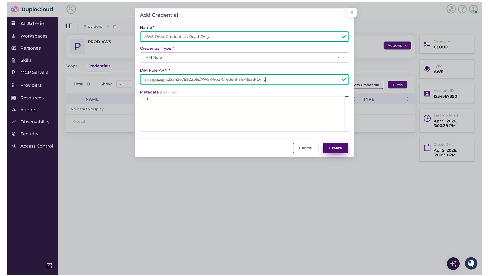
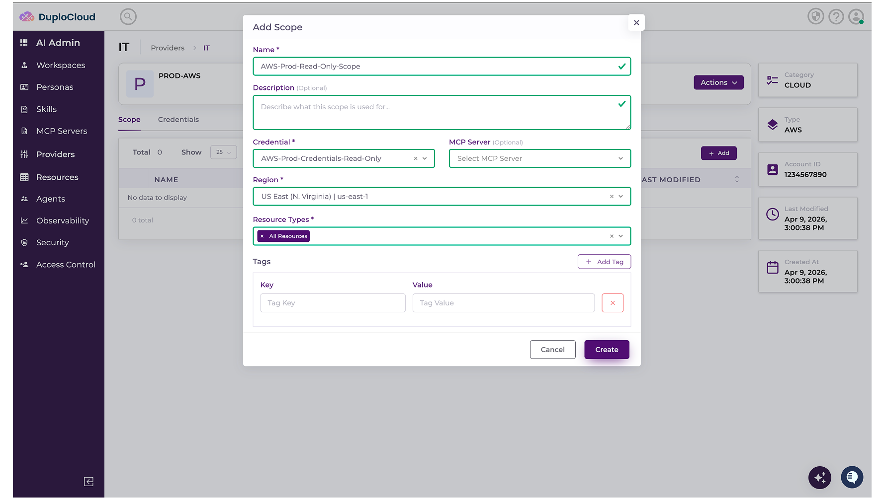

# Adding Providers

> Hack Day reference. Condensed from the [DuploCloud docs](https://docs.duplocloud.com/docs).
> Prerequisite: the platform running locally — see [Installing DevKit.md](<Installing DevKit.md>).

A **Provider** is the access you give the platform to one of your IT systems: a cloud account, a
Kubernetes namespace, a Git repository, an incident management tool, or any other service.

Adding one is three nested steps, and you need all three before an agent can do anything:

| Step | What it is |
| --- | --- |
| **1. Provider** | The system itself — "this AWS account", "this GitHub org" |
| **2. Credential** | The secret that authenticates to it |
| **3. Scope** | A named bundle of *credential + optional MCP server + resource map*. This is what you pick when filing a ticket, and what a Workspace inherits. |

**No Scope, no access.** A Provider with credentials but no Scope is invisible to agents.

---

## Provider types available

| Category | Options |
| --- | --- |
| **Cloud** | AWS, GCP, Azure |
| **Kubernetes** | EKS, AKS, GKE, RHOS |
| **Observability** | OpenTelemetry (Otel), Datadog, New Relic, Sentry |
| **Incident Management** | Grafana Alert Manager, Datadog, New Relic, Sentry, PagerDuty, Incident.io |
| **Source Control** | GitHub, GitLab, Bitbucket |
| **GRC** | Vanta, Drata |
| **Notifications** | SMTP |
| **Other** | Use this for anything not listed — including most MCP-backed tools |

---

## Walkthrough

### 1. Pick the Provider type

Navigate to **Providers** and select the tab for the type you're adding — **Cloud**, **Kubernetes**, and
so on.

### 2. Add the Provider

Click **Add**. The **Add Provider** screen shows the inputs for that type. Complete the required fields.

Click **Update** to finish. You're returned to the Provider's screen.

### 3. Add a Credential

Select the **Credentials** tab and click **Add**. Enter the credential specification and click **Update**.

> **Tip:** mark tokens, keys, and passwords as **Sensitive** so they're stored encrypted and masked in
> the UI.

### 4. Add a Scope

Click **Scope**, then **Add Scope**. Fill in:

- **Name** and **Description** — the name is what you'll see in the ticket scope picker, so make it
  recognisable
- **Credential** — one of the credentials you just added
- **MCP Server** *(optional)* — see [Adding MCP Servers.md](<Adding MCP Servers.md>)
- **Resource map** — `Key:Value` pairs

Click **Create**.

---

## You're done when

- [ ] The Provider appears in its category tab
- [ ] It has at least one Credential
- [ ] It has at least one Scope
- [ ] That Scope appears in the dropdown when you create a ticket

---

## Next

- [Adding MCP Servers.md](<Adding MCP Servers.md>) — extend the agent with external tools; MCP servers
  attach to a Scope, so do this after you have a Provider
- [Adding Skills.md](<Adding Skills.md>) — teach the agent tasks
- [Adding Workspaces.md](<Adding Workspaces.md>) — where Scopes and Personas come together

**Stuck?** See [Getting Support.md](<Getting Support.md>) — Slack, email, and the sponsor desk.
