# Adding Skills

> Hack Day reference. Condensed from the [DuploCloud docs](https://docs.duplocloud.com/docs).

**A Skill defines a task the agent can perform** — Kubernetes operations, CI/CD workflows, security
scans, or anything specific to your use case.

At its core a Skill is a folder containing a **`SKILL.md`** file: required metadata (at minimum a name
and description) plus instructions telling the agent how to do the task. It can also carry scripts,
templates, and reference material.

> **Write the name and description carefully.** They are how the agent decides *when* to apply the
> skill. Vague ones mean it won't fire at the right moment — or won't fire at all. See the
> [skill specification](https://agentskills.io/specification).

### Three kinds

| Type | What it is |
| --- | --- |
| **Pre-built** | Ships with the platform. Enough to configure your first Workspace. |
| **External** | Third-party skills pulled from a URL — [Pulumi](https://github.com/pulumi/agent-skills/), [HashiCorp](https://github.com/hashicorp/agent-skills/), [Azure](https://github.com/microsoft/skills/) |
| **Custom** | Your own — a pasted `SKILL.md`, an uploaded zip, or a private Git repo |

All live under **AI Admin → Skills**.

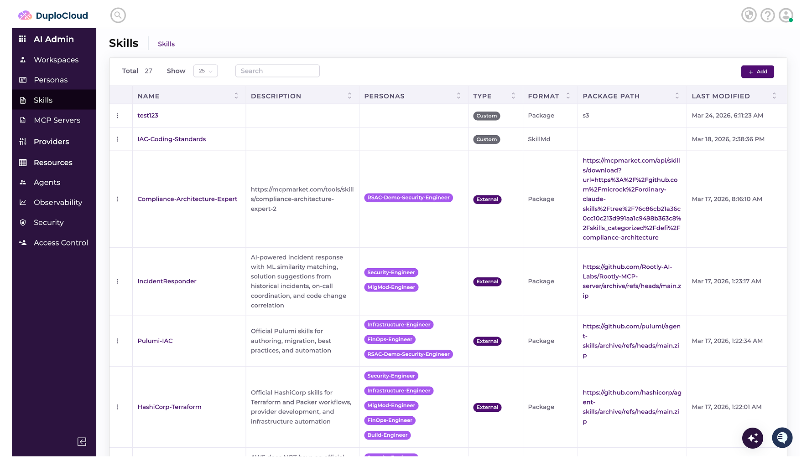

---

## Method 1 — External skill

For a skill hosted at a public or vendor URL.

1. **AI Admin → Skills → + Add**
2. Fill in:
   - **Name** — unique identifier (e.g. `Kubernetes-Troubleshooting`)
   - **Type** — **External**
   - **Vendor** *(optional)* — the provider (e.g. `DuploCloud`)
   - **Package URL** — the `.zip` URL
3. Click **Create**.

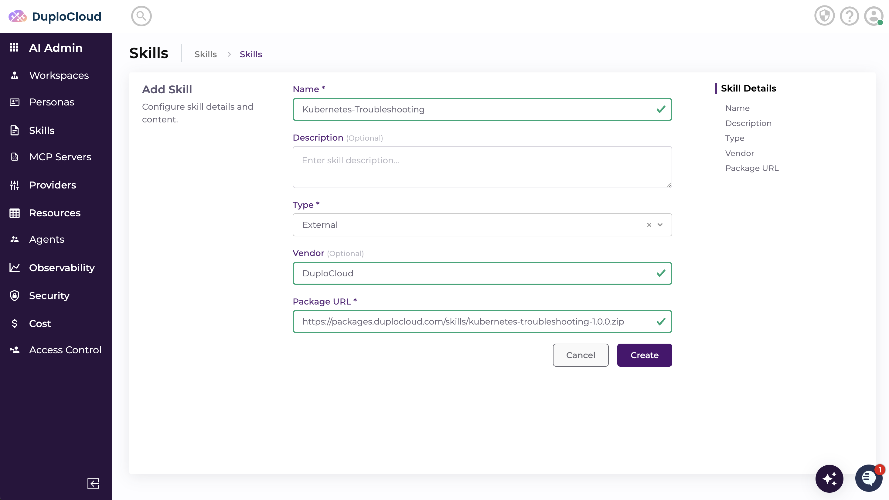

---

## Method 2 — Custom skill

### As a pasted `SKILL.md` — fastest for Hack Day

1. **AI Admin → Skills → + Add**
2. Fill in **Name**, set **Type** to **Custom**, add an optional **Description**
3. Paste your `SKILL.md` content straight into the editor on the page
4. Click **Create**.

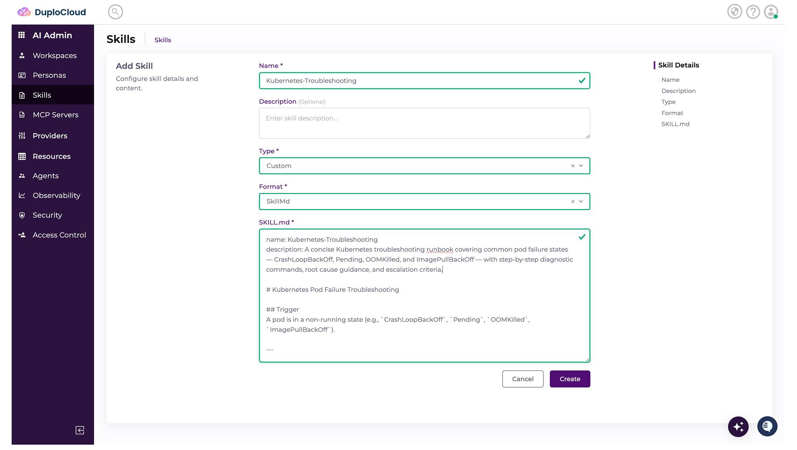

### As an uploaded package

1. **AI Admin → Skills → + Add**
2. Fill in **Name**, **Type** → **Custom**, optional **Description**
3. Click **Create**
4. Upload the zip from the package explorer in the **kebab menu** on the Skills list page

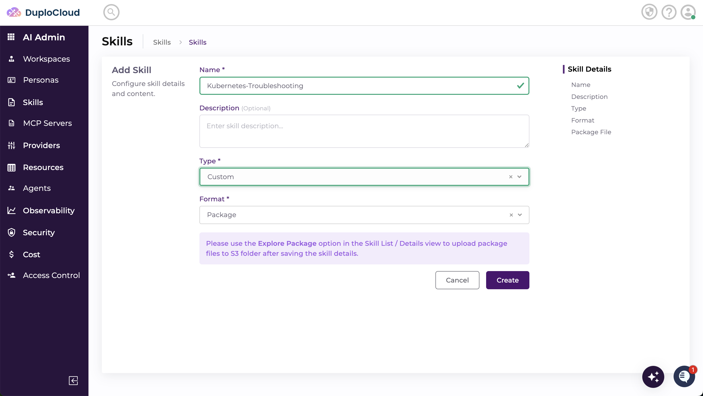

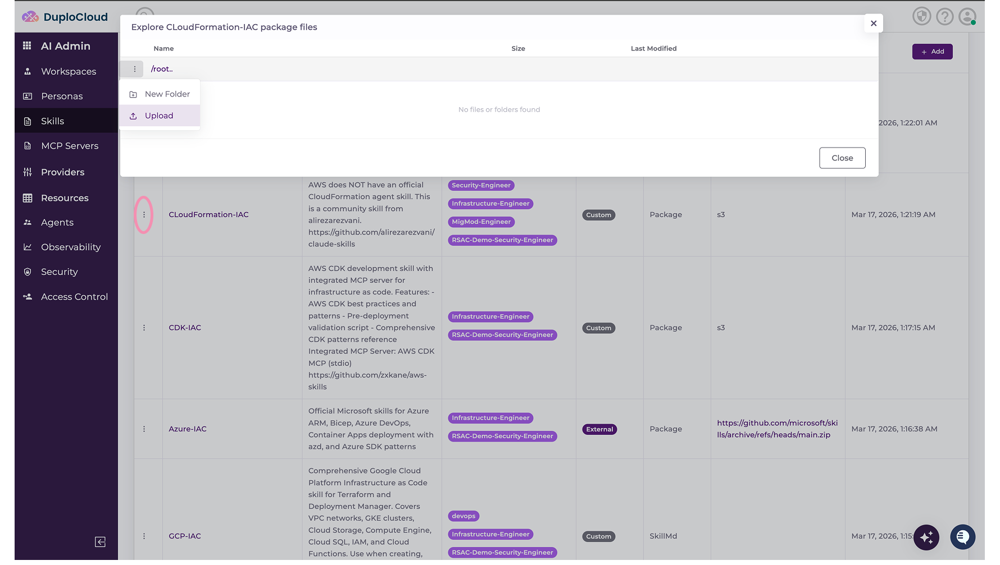

---

## Method 3 — From a private Git repository

Version control and updates without re-uploading.

1. **AI Admin → Skills → + Add**
2. Fill in:
   - **Name** — unique identifier (e.g. `Jira-skill`)
   - **Type** — **Private Git Repository**
   - **Scope** — a GitHub provider you've already configured (see
     [Adding Providers.md](<Adding Providers.md>))
   - **Organization Name** — your GitHub org or username
   - **Repository Name** — the repo holding the skill
   - **Ref** — the branch (e.g. `main`)
   - **Folder** *(optional)* — the subfolder the skill lives in

> **⚠️ The file must be named `SKILL.md`.** Any other name and the agent cannot find or load the skill.

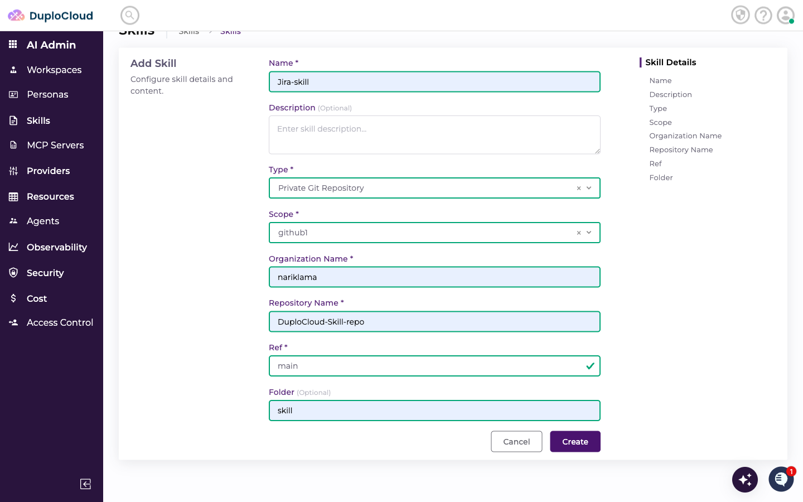

3. Click **Create**. The Skills list shows it at the top with a fresh **Last Modified** timestamp.

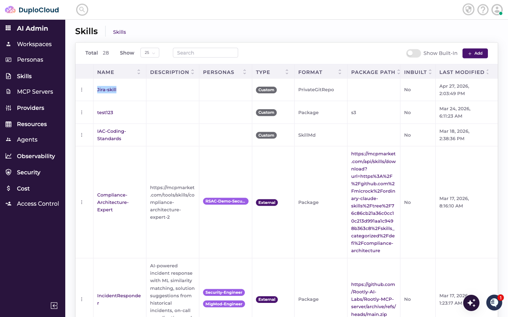

---

## Using a skill in a ticket

### Attach it

When creating a ticket, expand **Advanced Options** and open **Additional Skills**. Select your skill —
the agent loads and follows it for the life of that ticket, on top of its persona behaviour.

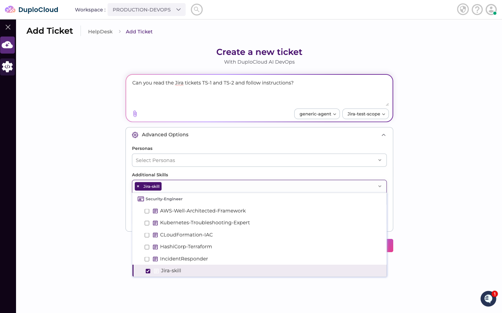

Once created, the agent confirms the skill is loaded, and the **Context Files** panel shows the skill
folder in the session.

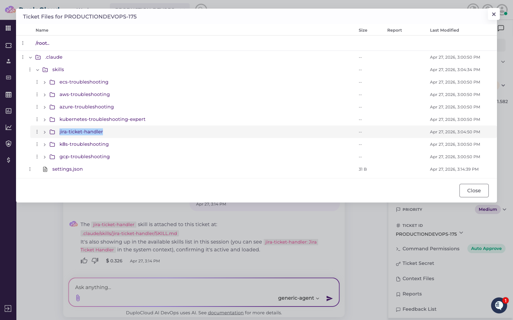

### Reference it inline with `/`

Rather than letting it run silently, you can call it out. Type `/` at the start of a message, or after a
space, to open a picker of the skills already attached to that ticket.

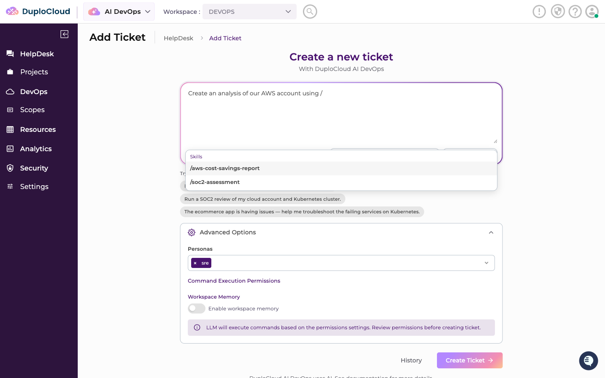

Keep typing to filter — it matches anywhere in the name, not just the start. Arrow keys plus **Enter**
(or **Tab**) to select, or click a row. It inserts `/skill-name ` at your cursor.

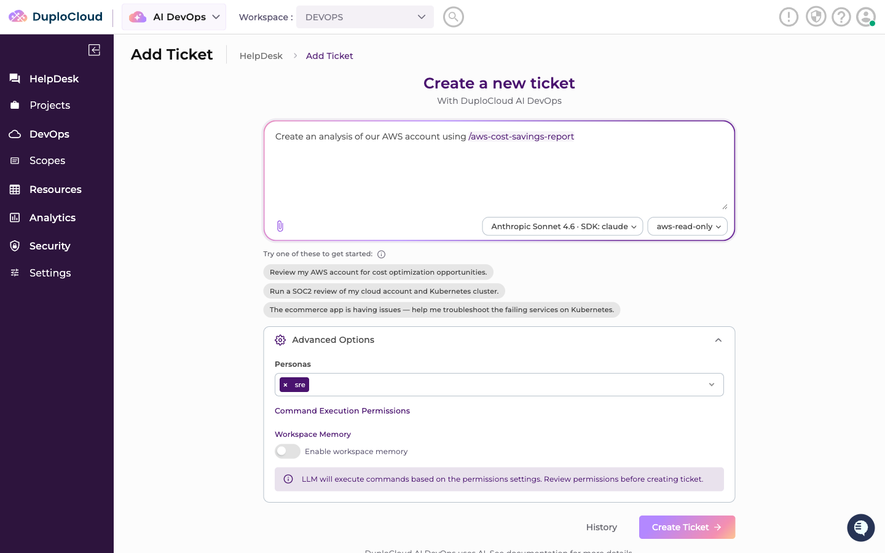

Works the same in an existing ticket's chat input.

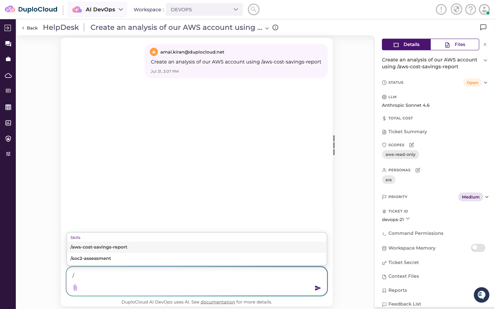

> **The picker only lists skills already attached** to the ticket. It's for referencing one inline, not
> for attaching a new one — use **Additional Skills** for that.

---

## Skill folder structure

A skill can be a single file, or a folder tree for something larger:

```
skills/
├── SKILL.md
├── infrastructure/
│   ├── terraform.md
│   ├── kubernetes.md
│   └── cloud-provisioning.md
├── cicd/
│   ├── pipeline-management.md
│   └── deployment-strategies.md
├── observability/
│   ├── monitoring.md
│   └── logging.md
└── incident-response/
    ├── troubleshooting.md
    └── root-cause-analysis.md
```

### A minimal `SKILL.md`

```markdown
---
name: my-skill-name
description: "What this does. MUST invoke when: (1) the user mentions X;
  (2) the user asks about Y; (3) the task involves Z."
metadata:
  author: your-name
  version: "1.0"
---

# My Skill

## Core principle

One or two sentences on how this task actually works.

## Steps

1. Do the first thing.
2. Then the second.

## Best practices

- The thing people get wrong.
```

The `description` is doing the real work — spell out the trigger conditions explicitly, as above. A
longer worked example is in the [full docs](https://docs.duplocloud.com/docs).

---

## You're done when

- [ ] The skill appears in the Skills list
- [ ] You can select it under **Additional Skills** when creating a ticket
- [ ] The agent confirms it's loaded, and it shows in **Context Files**

---

## Next

- [Adding Personas.md](<Adding Personas.md>) — group related skills by role
- [Adding Workspaces.md](<Adding Workspaces.md>) — put personas and scopes together

**Stuck?** See [Getting Support.md](<Getting Support.md>) — Slack, email, and the sponsor desk.
