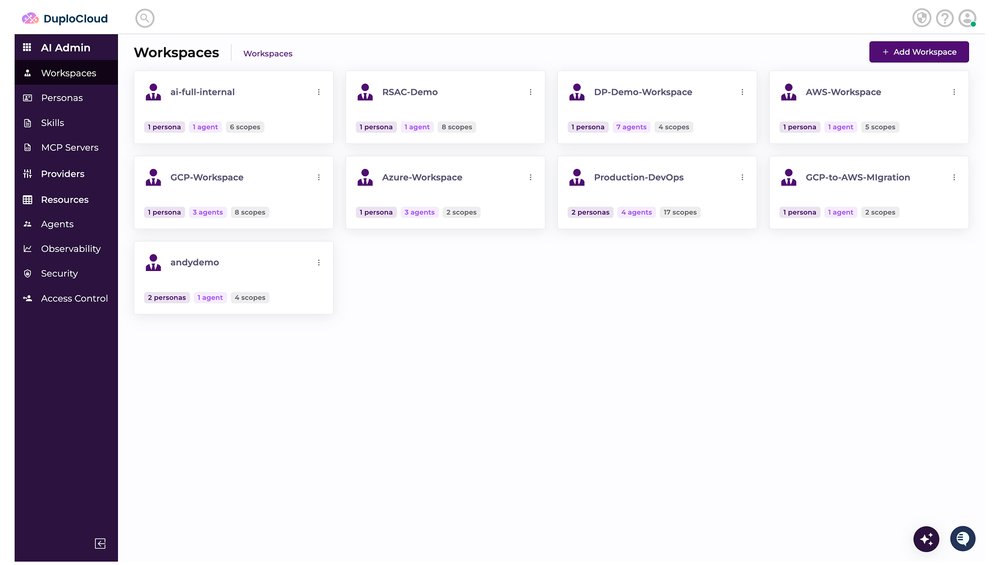
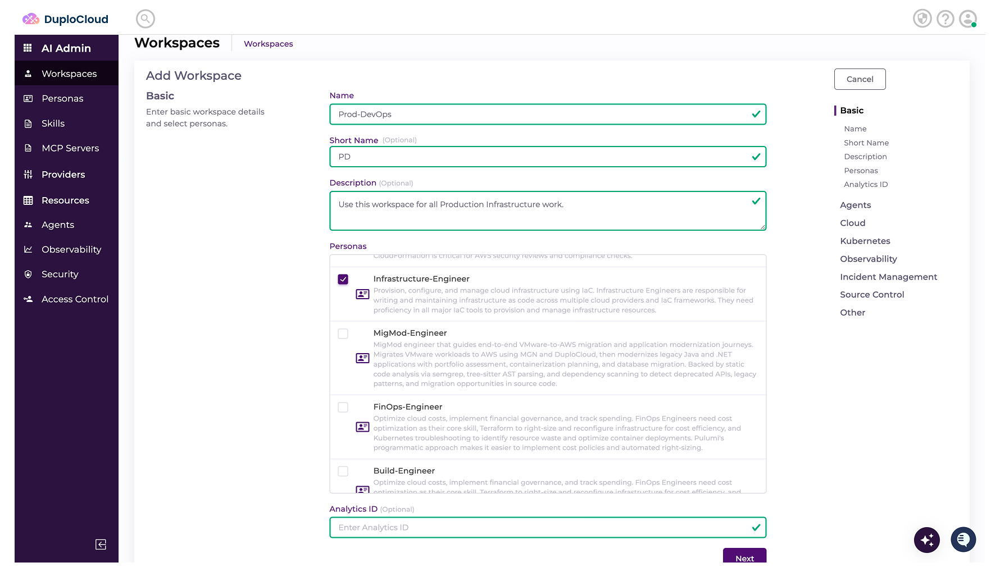
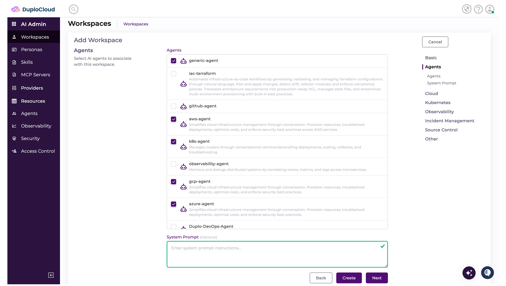
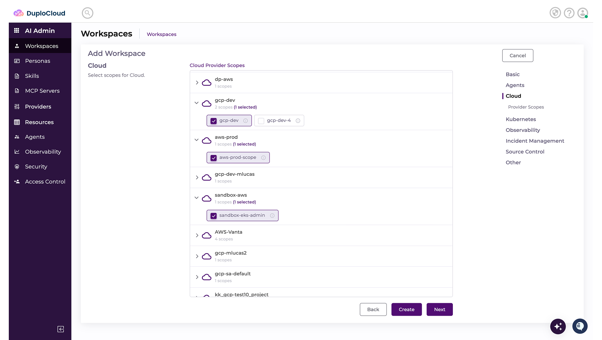
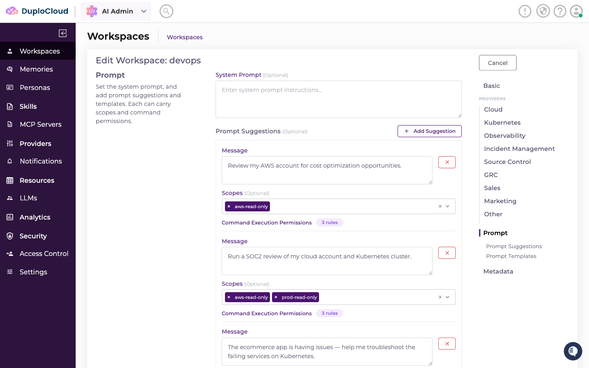

# Adding Workspaces

> Hack Day reference. Condensed from the [DuploCloud docs](https://docs.duplocloud.com/docs).
> Prerequisites: at least one Scope ([Adding Providers.md](<Adding Providers.md>)) and one Persona
> ([Adding Personas.md](<Adding Personas.md>)).

**This is where it all comes together.** A Workspace is the central entity — attach any number of
**Scopes** and **Personas** to it, then invite users. Multiple Workspaces give you clean separation of
responsibilities across an organization.

```
Provider → Credential → Scope ─┐
                               ├─→ WORKSPACE → users file tickets here
Skills → Persona ──────────────┘
```

---

## Creating a Workspace

### 1. Start

Navigate to **Workspaces** and click **Add Workspace**.



### 2. Name it and pick Personas

Give it a **Name** and **Description**, select the **Persona(s)** to include, and click **Next**.



### 3. Pick the Agents

Select the **Agent(s)** that do the work in this Workspace, then **Next**.



### 4. Pick the Scopes

You get one screen per **Provider**. On each, select the **Scopes** to include, then **Next** — keep
going until you've reviewed them all.



### 5. Click **Create**

Your Workspace is ready to receive assignments, interpret goals, break down work, and provide an audit
trail — with human oversight throughout.

---

## Setting a System Prompt

Each Workspace can define a **System Prompt**: free-text instructions injected verbatim into the agent's
system prompt on **every ticket** in that Workspace.

Open the workspace, go to the **Prompt** step (same place as Prompt Suggestions and Prompt Templates),
enter your instructions in **System Prompt**, and save.



> **Three things can instruct the agent — know which is which:**
>
> | | What it is |
> | --- | --- |
> | **System Prompt** | One field, always injected verbatim, every ticket in the workspace |
> | **Agent Memories** | Files the agent reads on demand; can be switched off per ticket |
> | **Persona instructions** | Inherited from the Persona — and they **take precedence** over the System Prompt if the two conflict |

---

## You're done when

- [ ] The Workspace appears in the Workspaces list
- [ ] You can select it in the workspace selector
- [ ] Creating a ticket in it offers the Scopes you attached
- [ ] The agent answers a real question using one of those Scopes

That last one is the real test — everything before it is configuration.

---

## The full chain, in order

1. [Adding Providers.md](<Adding Providers.md>) — Provider → Credential → Scope
2. [Adding MCP Servers.md](<Adding MCP Servers.md>) — *optional*; bind external tools to a Scope
3. [Adding Skills.md](<Adding Skills.md>) — the tasks the agent can do
4. [Adding Personas.md](<Adding Personas.md>) — group Skills by role
5. **Adding Workspaces.md** — tie Scopes and Personas together ← you are here

**Stuck?** See [Getting Support.md](<Getting Support.md>) — Slack, email, and the sponsor desk.
