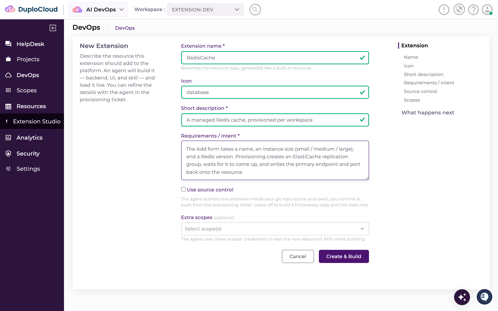

# DuploCloud DevKit — Hack Day Setup

[](../LICENSE)
[](https://github.com/duplocloud/devkit/releases)

**Do this before you arrive.** You have six hours on Hack Day — spend them on your agent, not on
image pulls over conference wifi.



---

## What you're setting up

The whole DuploCloud platform — six containers — running on your laptop via Docker. On top of it you
build an **Agent**: your own backend, your own UI, your own provisioning workflow, hot-loaded into the
running platform with no restart. You describe what you want in plain language and Claude Code builds it.

**Time:** 20–40 minutes, most of it waiting on image pulls. Do it on home wifi.

---

## 1. Before you start

| You need | Notes |
| --- | --- |
| **Docker** with Compose v2 | The standalone `docker-compose` v1 binary does **not** work |
| **Python 3** on your `PATH` | `run.sh` uses it as its `.env` editor and JSON parser |
| **Claude Code** | This is how you build the agent — `/duplo-extension` lives in the repo's `.claude/` |
| **An LLM key** | An Anthropic `sk-ant-…` key, **or** AWS credentials with Bedrock access, **or** an Anthropic-compatible gateway (OpenRouter, Bifrost, LiteLLM) |
| **A work email address** | Personal domains (gmail.com, outlook.com, …) are **rejected** — see the callout in step 2 |
| **Five free ports** | `4210`, `60031`, `8010`, `27018`, `6061`, plus `6333` for Qdrant |

Verify the first two in one line:

```bash
docker --version && docker compose version && python3 --version
```

---

## 2. Install

**1. Clone the dev kit.**

```bash
git clone https://github.com/duplocloud/devkit my-agent
cd my-agent
```

**2. Adopt the clone into your own repo.** This points `origin` at your repository and seeds your first
extension directory — do it now so your Hack Day work has somewhere to live.

```bash
./scripts/init-project.sh git@github.com:<your-github-user>/<your-repo>.git
```

**3. Start it.**

```bash
./run.sh
```

> ### ⚠️ The email step will block you — read this first
>
> `run.sh` prompts for `Admin email:`. **Use your work address** — personal domains are not accepted.
>
> DuploCloud then emails that address a **verification link**, and **the run stops and waits** for you to
> click it, for up to 2 minutes. Click it and the run continues on its own.
>
> If it times out, nothing is lost — click the link whenever it arrives, re-run `./run.sh`, and it resumes
> the same request. No second email is sent. **Check your spam folder** before assuming it never arrived.
>
> Mistyped the address? Re-run with the right one: `./run.sh --email you@yourcompany.com`. The stale
> request is discarded and your trial is still intact.

The remaining prompts: `Admin password:` (stored in the database — editing `.env` later won't change it),
`Select LLM provider:` (`1` anthropic, `2` bedrock) and its key, and `Opt out of usage metrics? [y/N]:`.

**4. Sign in.** `./run.sh` prints `✔ Platform ready` when the stack is up. Go to
**<http://localhost:4210>** and sign in with that email and password.

---

## 3. Check it actually worked

Before you close the laptop, confirm all three:

- [ ] `docker compose ps` shows every service **Up**
- [ ] <http://localhost:4210> loads and you can sign in
- [ ] You land with the **`extension-dev`** workspace selected

If all three pass, you're ready for Hack Day.

---

## 4. Build your first agent

You don't have to do this before Hack Day, but doing it once means you'll know the loop cold.

```bash
cd my-agent
```

Start Claude Code in that directory — it picks up the repo's `.claude/` directory, which is what makes the
authoring command available. Then:

```
/duplo-extension
```

It probes your platform, asks **local or remote** (choose **local**), then interviews you about what you
want to build and builds it. The new Agent appears as a menu item in the portal seconds later — no restart.

**A worked example to follow:** [docs/quickstart.md §6](../docs/quickstart.md#6-build-your-first-ai-app)
walks you through a domain WHOIS lookup agent — small, real, and needs no cloud credentials.

---

## 5. Sponsor tool integrations

Step-by-step wiring for **Neo4j**, **Crusoe**, **Nebius**, and **Vultr**:
**[Sponsor Integrations.md](<Sponsor Integrations.md>)**

Each takes 10–15 minutes and counts toward one of the two prizes — see below.

---

## 6. If you get stuck

**`./run.sh` exits immediately naming something missing** — it checks `python3` and `docker compose` v2
before touching anything. Install what it names and re-run. The list it prints is the complete list.

**`port is already allocated`** — find what's holding it, then either stop that or move the dev kit:

```bash
lsof -nP -iTCP:4210 -sTCP:LISTEN     # who has it?
```

To move it, edit the `*_PORT` value in `.env` and re-run. **Don't delete the line** — an unset `*_PORT`
falls back to the platform default (`UI_PORT` becomes 4200, not 4210), which collides more, not less.
`QDRANT_PORT=6333` is the one most likely to clash if you already run Qdrant locally.

**The run is waiting on a verification link** — expected. See the callout in step 2.

**Anything else** — [docs/troubleshooting.md](../docs/troubleshooting.md) has symptoms, causes, and fixes.

### Get help

- **Email:** hackday@duplocloud.net
- **Slack:** [join the Hack Day community](https://join.slack.com/t/hackday-brv1895/shared_invite/zt-4ar74ve28-YSK96VM1ERprQXoTIbTGBA) — do this before the day
- **On the day:** our team is at the sponsor table all day — come find us
- **Tech Spotlight:** a five-minute walkthrough on the main stage

Full detail, and what to include when you ask: [Getting Support.md](<Getting Support.md>)

---

## 7. How you'll be judged

**Two prizes. One project can go for both.**

**Best agent overall** — judged on what it actually does end to end. Not the pitch, not the slide. Does it
run, and does it do the thing you said it does, live, when we look at it?

**Most sponsor tools wired in, meaningfully** — and *meaningfully* is the operative word. Wiring something
up isn't the bar. Every tool you connect has to actually do something in your project. If it's plugged in
and doing nothing, it doesn't count, and we'll be able to tell.

**See you on September 29th.**

---

*This kit is for local development only. See [LICENSE](../LICENSE) and [TERMS.md](../TERMS.md); for a
production license, contact sales@duplocloud.net.*
