# Sponsor Integrations

Wire a sponsor tool into your agent. **Pick one and follow it top to bottom.**

| Sponsor | What you get | Time |
| --- | --- | --- |
| **[Neo4j](#neo4j)** | Agent queries a graph database | ~15 min |
| **[Crusoe / Nebius](#crusoe--nebius-via-openrouter)** | Agent runs on their GPUs via OpenRouter | ~10 min |
| **[Vultr](#vultr)** | Agent calls the Vultr API | ~10 min |

Prerequisite: platform running — [Installing DevKit.md](<Installing DevKit.md>).

> **Prize note:** every tool you connect must *do something* in your project. Plugged in and idle doesn't count.

---

## Neo4j

Two options. **Option B is faster** — no MCP server, no container changes.

| | How the agent talks to it |
| --- | --- |
| **A — MCP server** | Calls `mcp-neo4j-cypher` tools |
| **B — Plain scope** | Runs inline Python with `jq`-read credentials |

### Get a graph first (both options)

1. [console.neo4j.io](https://console.neo4j.io) → sign up
2. **New Instance** → **AuraDB Free**
3. Name it, pick a region, **Create**
4. **Click "Download to continue" immediately** — the password is shown once and cannot be recovered
5. Optional: load a sample dataset so there's data to query
6. From **Connection details**, collect:

| Value | Example |
| --- | --- |
| `uri` | `neo4j+s://<instance-id>.databases.neo4j.io` |
| `username` | `neo4j` |
| `password` | from the downloaded file |
| `database` | `<instance-id>` — **not** literally `neo4j` |

---

### Option A — via MCP server

#### 1. Register the MCP server

**AI Admin → MCP Servers → Add**

| Field | Value |
| --- | --- |
| Name | `neo4j-mcp` |
| Provider Type | **`Other`** → type `other` in the text box |
| Config Type | **`Raw`** |

```json
{
  "mcpServers": {
    "neo4j": {
      "command": "/usr/local/bin/mcp-neo4j-cypher",
      "args": [],
      "env": {
        "NEO4J_URI": "${credential.uri}",
        "NEO4J_USERNAME": "${credential.username}",
        "NEO4J_PASSWORD": "${credential.password}",
        "NEO4J_DATABASE": "${credential.database}",
        "NEO4J_TRANSPORT": "stdio",
        "NEO4J_SCHEMA_SAMPLE_SIZE": "1000",
        "MCP_TIMEOUT": "7000"
      }
    }
  }
}
```

**Create.**

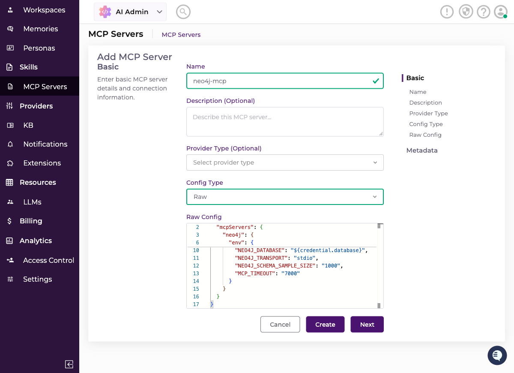

> **⚠️ Set Provider Type now.** Leaving it blank makes step 4 fail with
> `McpServer provider type '' does not match Scope provider type 'other'`.

> **JSON editor mangling your paste?** It auto-closes brackets. Paste, then fix the trailing braces.

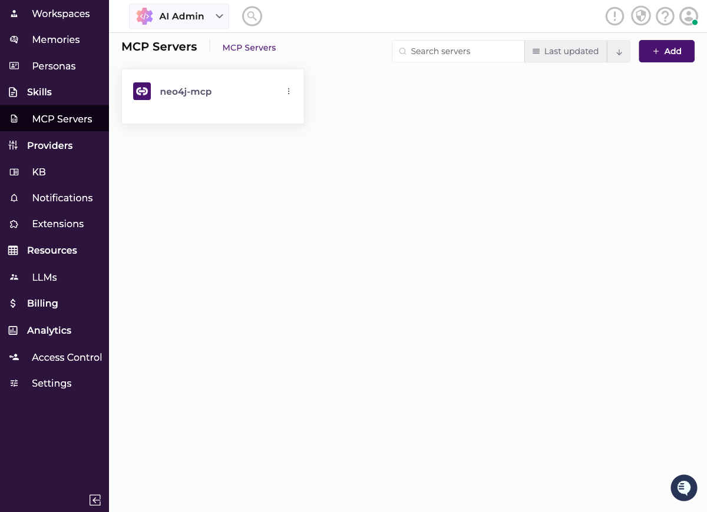

#### 2. Create the provider

**Providers → IT → Other → Add**

| Field | Value |
| --- | --- |
| Name | `neo4j-mcp` |
| Type | `Other` |
| Account ID | your `uri` |

**Next.**

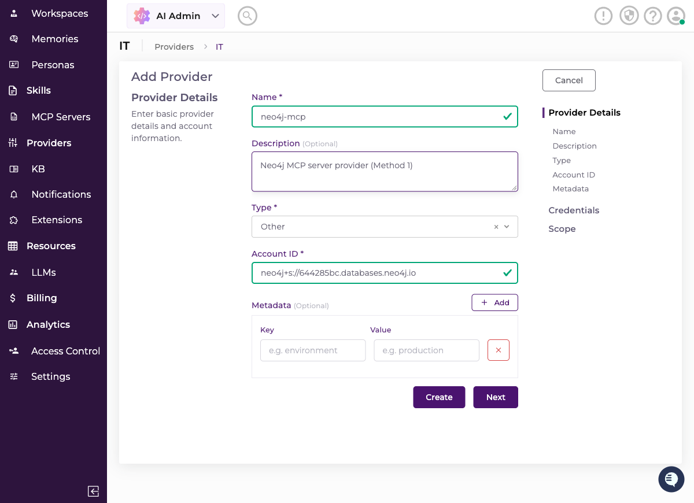

#### 3. Add credentials

Name it `neo4j-credentials`, then add four fields — **names must match the `${credential.*}` keys exactly, lowercase:**

`uri` · `username` · `password` · `database`

Leave Type `String` and Sensitive on. **Next.**

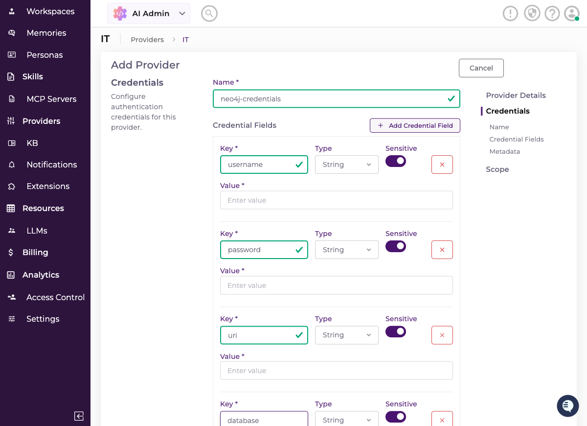

#### 4. Create the scope — **skip the wizard step**

The wizard's Scope step marks MCP Server *(Optional)* and **silently discards your scope.** Don't use it.

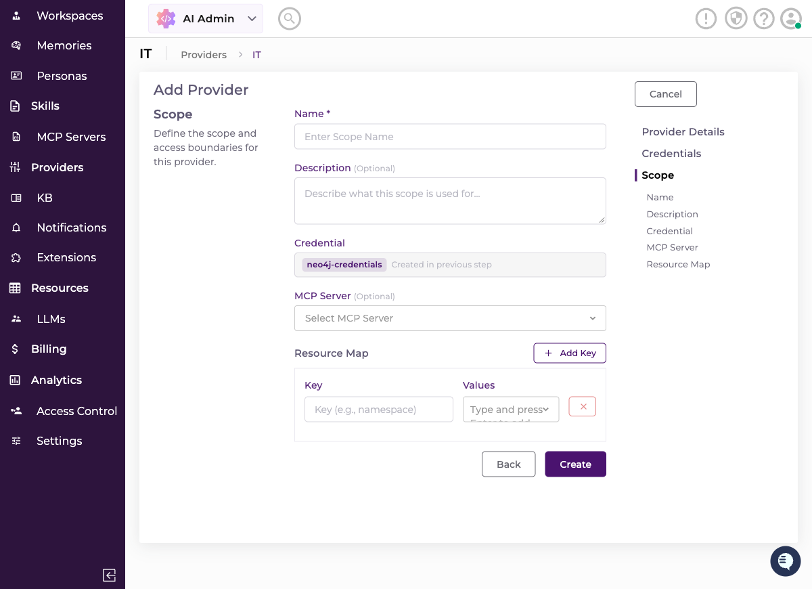

Instead: **Provider detail page → Scope tab → Add.** MCP Server is required (`*`) there.

| Field | Value |
| --- | --- |
| Name | `neo4j-mcp-scope` |
| Credential | `neo4j-credentials` |
| MCP Server | `neo4j-mcp` |

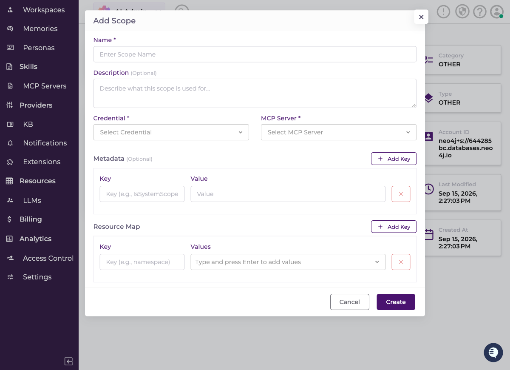

<details>
<summary>Got <code>provider type '' does not match</code>?</summary>

You left Provider Type blank in step 1. **AI Admin → MCP Servers → neo4j-mcp → Edit** → set Provider Type to `Other` and type `other` in the box. Retry Add Scope.

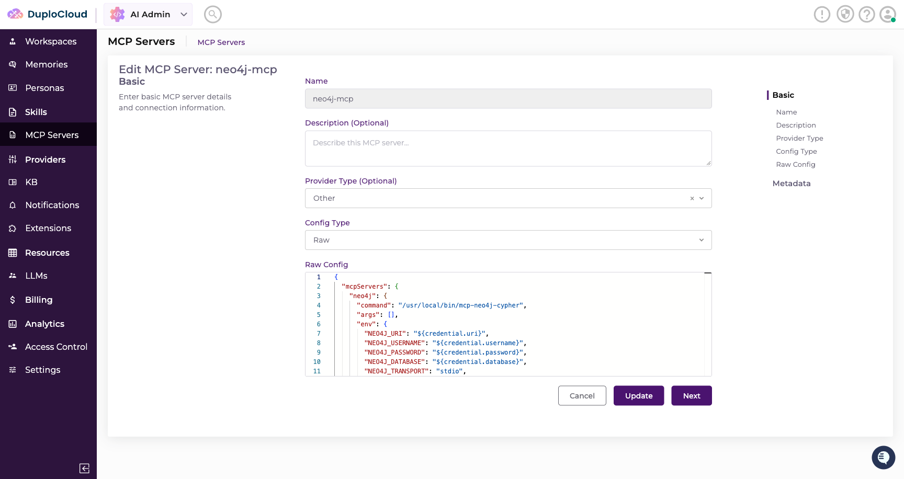

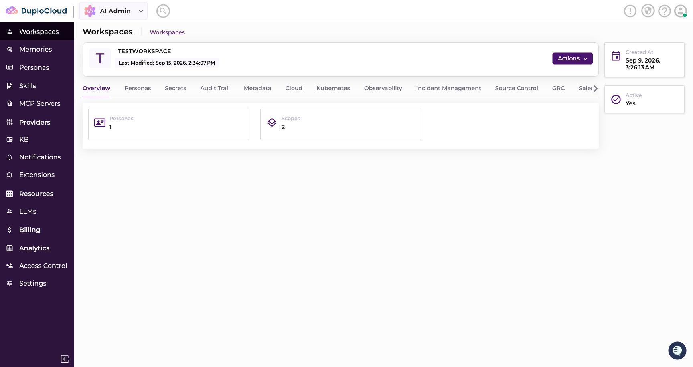
</details>

#### 5. Attach to a workspace

From the **Scope Created** prompt (or Scope tab → row menu), pick your workspace → **Attach**.

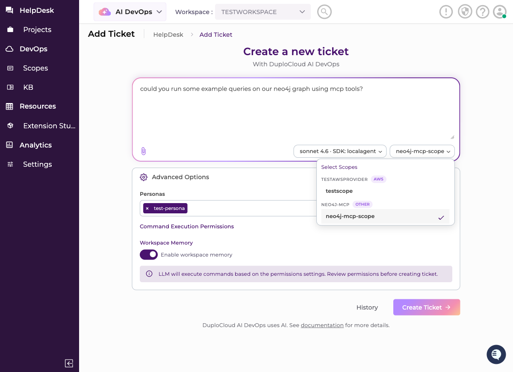

#### 6. Enable on a ticket

Attaching makes it *available*, not active. When creating a ticket, open **Select Scopes** and pick `neo4j-mcp-scope`.

#### 7. Verify

> Could you run some example queries on our neo4j graph using mcp tools?

The agent should discover and call `get_neo4j_schema` / `read-neo4j-cypher`.

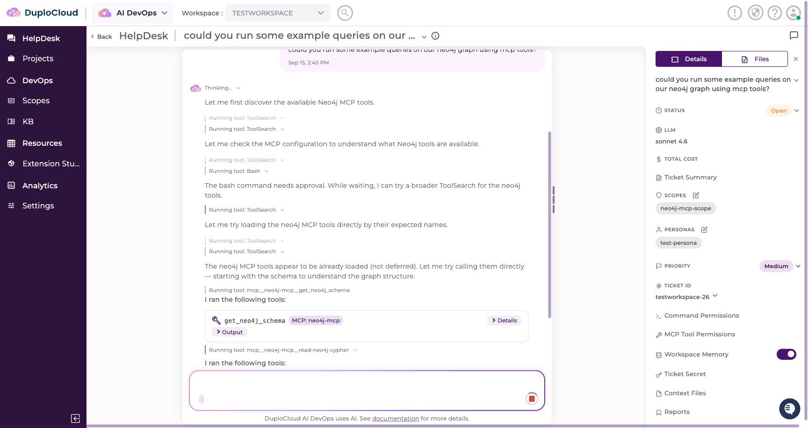

> **`command not found`?** `mcp-neo4j-cypher` must exist in the agent image. Add `pip install mcp-neo4j-cypher` to the Dockerfile, or set `command` to `uvx` with `args: ["mcp-neo4j-cypher"]`.

---

### Option B — via plain scope

No MCP server. The agent reads credentials and writes its own Python.

#### 1. Create provider + credential + scope

**Providers → IT → Other → Add Provider**

| Field | Value |
| --- | --- |
| Name | `neo4j` |
| Type | `Other` |
| Account ID | your `uri` |

**Next** → add credential fields `uri` · `username` · `password` · `database` → **Next** → name the scope `neo4j-scope` and **leave MCP Server empty** → pick your workspace.

#### 2. Enable on a ticket

Same as Option A — **Select Scopes** → `neo4j-scope`. Without this the agent has no `other_scopes/neo4j-scope.json` and nothing works.

#### 3. Verify

> Using the neo4j scope, connect to the Neo4j graph and tell me the total node count, total relationship count, and the distinct node labels.

The agent `jq`s the scope file for credentials, then runs inline Python via `from neo4j import GraphDatabase`.

> **`ModuleNotFoundError: neo4j`?** Add `pip install neo4j` to the agent Dockerfile.

---

## Crusoe / Nebius (via OpenRouter)

Run the agent's model on Crusoe or Nebius GPUs. OpenRouter fronts both at one fixed endpoint; a **preset** pins each request to one provider.

### 1. OpenRouter account

1. Sign up at [openrouter.ai](https://openrouter.ai)
2. **Settings → Credits** — ~$10 is plenty
3. **Settings → Keys** → create one. **Copy it now** (`sk-or-v1-…`) — shown once

### 2. Create a preset per provider

**Settings → Presets → New Preset**

1. **Name** it for the pairing, e.g. `duplo-nebius-qwen`. The auto-filled **slug** is what you reference as `@preset/duplo-nebius-qwen`
2. **Add model** — e.g. `qwen3-235b-a22b-2507`
   - **Must support tool calling**, or the agent can never call a tool. Filter for it on [openrouter.ai/models](https://openrouter.ai/models)
   - Skip `:free` variants
   - Watch for near-duplicates — plain `qwen/qwen3-235b-a22b-2507` is the Instruct one, not Thinking
3. Check **Include Provider Preferences**:
   - Type the provider name (`nebius`) and check it — this is what actually pins the request
   - **Allow fallbacks → No.** Left on, a busy provider gets silently swapped and the pin is meaningless
4. **Leave everything else blank.** Values here *override* every request — a max-tokens here becomes a hard ceiling on agent output
5. Save, and repeat for the next pairing

**Validated pairings:**

| Preset | Model | Provider | Context |
| --- | --- | --- | --- |
| `duplo-nebius-qwen` | `qwen/qwen3-235b-a22b-2507` | nebius | 262144 |
| `duplo-crusoe-kimi` | `moonshotai/kimi-k2.6` | crusoe | 262144 |
| — | `z-ai/glm-5.3` | crusoe | 1310720 |
| — | `openai/gpt-oss-120b` | nebius | 131072 |

### 3. Point the agent at it

```bash
ANTHROPIC_BASE_URL=https://openrouter.ai/api      # fixed, same for everyone
ANTHROPIC_AUTH_TOKEN=sk-or-v1-...                 # your key
CLAUDE_MODEL=@preset/duplo-nebius-qwen            # or @preset/duplo-crusoe-kimi
CLAUDE_CODE_MAX_CONTEXT_TOKENS=262144             # the model's real window, from the table
CLAUDE_CODE_AUTO_COMPACT_WINDOW=200000            # optional; keep below the line above
```

> **⚠️ Not yet confirmed working through this repo's agent.** Leaving `ANTHROPIC_API_KEY` unset — which the standalone Claude CLI requires for this mode — makes `build_provider_env()` fall through to the Bedrock branch, so the agent talks to Bedrock instead. Verify with step 4 before relying on it.

> **Set `CLAUDE_CODE_MAX_CONTEXT_TOKENS` correctly.** The CLI assumes 200K for unrecognized model ids; if the real window is smaller the session hard-fails mid-run instead of compacting.

### 4. Confirm the pin

```bash
curl -s https://openrouter.ai/api/v1/messages \
  -H "content-type: application/json" \
  -H "authorization: Bearer sk-or-v1-..." \
  -H "anthropic-version: 2023-06-01" \
  -d '{"model":"@preset/duplo-nebius-qwen","max_tokens":50,
       "messages":[{"role":"user","content":"Say only OK"}]}'
```

Look for `"provider"` matching what you pinned, and `"usage": {"is_byok": false}` while on credits.

| Result | Cause |
| --- | --- |
| Wrong provider | Model string isn't `@preset/<slug>`, or fallbacks left on |
| `rate_limit_exceeded` / `upstream_provider_shared_pool` | That provider is saturated — retry, switch model, or go BYOK |

### Optional — pay Crusoe/Nebius directly (BYOK)

Same env vars; only billing changes. OpenRouter takes 5% of list price, waived above $25K/month.

1. **Settings → BYOK** — confirm Nebius and Crusoe rows exist
2. Get keys from [studio.nebius.com](https://studio.nebius.com) and [console.crusoecloud.com](https://console.crusoecloud.com) (add credits there too)
3. Add each key, mark it **Prioritized**. Check the shared-capacity-fallback setting — enabled, a failure on your key silently drops back to credits
4. Keep a small OpenRouter balance for fees
5. Re-run the step 4 curl — `usage.is_byok` should flip to `true`. Still `false` means the shared pool served it: check the key is Prioritized and the upstream account has the model

---

## Vultr

No MCP server, no code — `curl` and `jq` already ship in the agent image.

### 1. Get an API key

Sign up and **add a payment method** — API access stays disabled until the account is validated with a minimum charge.

1. Account name (top-right) → **Manage User**

   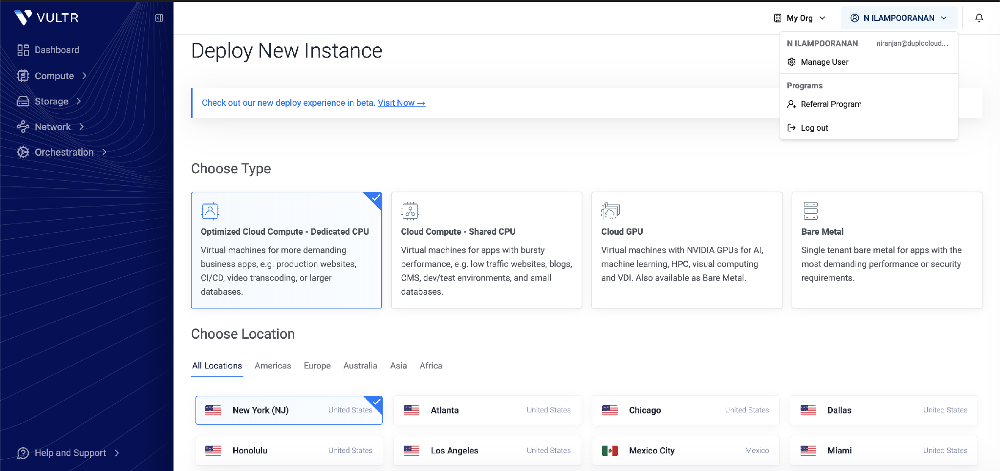

2. Left nav → **Access → API Access**
3. If disabled, click **Enable API Access**

   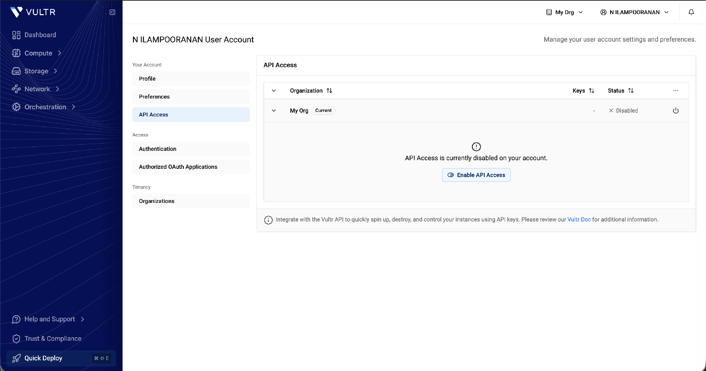

4. **Copy the key from the popup** — shown in full only once
5. **Access Control List** — two wide-open entries (`0.0.0.0/0`, IPv6 equivalent) are enabled by default, so the key works from anywhere. To restrict: disable both (power-toggle), then **Add IP to Allowlist** → enter subnet + prefix → **Add Subnet**

   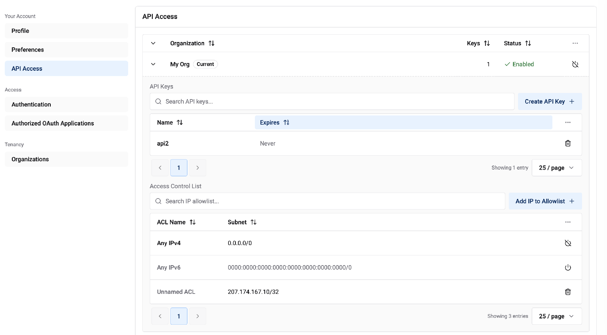

> **This allowlist is the only real control on the key** — DuploCloud can't narrow its permissions afterwards.

### 2. Create provider + credential + scope

**Administration → Providers → IT → Other → Add** — one wizard does all three.

**Provider:**

| Field | Value |
| --- | --- |
| Name | `vultr-<team>` |
| Type | `Other` |
| Account ID | `https://api.vultr.com/v2` |
| Description | paste the curl from step 3 — **this text goes into the agent's system prompt**, and is the only way to teach it the call without a code change |

**Credential:**

| Field | Value |
| --- | --- |
| Name | `vultr-api` |
| Key | **`apikey`** — lowercase, type Secret, Sensitive on |
| Value | your key |

> **⚠️ Lowercase `apikey`.** The platform lowercases credential keys before storing, so `apiKey` reads back `null` and fails as an auth error, not a config one.

**Scope:** name it `vultr-<team>`, leave **MCP Server empty**. Save, then attach to your workspace.

### 3. Verify

```bash
curl -s -H "Authorization: Bearer $(jq -r '.Credential.Data.apikey' other_scopes/vultr-<team>.json)" \
  https://api.vultr.com/v2/instances
```

Use the `$(jq ...)` substitution rather than pasting the key — it keeps the raw value out of the Bash approval prompt and out of container logs.

Run a throwaway ticket asking the agent to list Vultr instances, and check:

- [ ] It uses `$(jq ...)`, not the literal key
- [ ] Real data comes back
- [ ] `other_scopes/vultr-<team>.json` exists during the run, gone after
- [ ] No `.mcp.json` entry was created

---

## Pattern for any other sponsor

Every integration above is the same four things:

1. **Provider** — `Other` type, Account ID = the API base URL
2. **Credential** — lowercase keys, Sensitive on
3. **Scope** — MCP Server set (MCP tools) or empty (plain REST)
4. **Attach to workspace**, then **enable on the ticket**

So: does the sponsor ship an MCP server? Set it on the scope. Otherwise it's a REST API — put the recipe in the provider Description and let the agent `curl` it.

**Stuck?** See [Getting Support.md](<Getting Support.md>).
